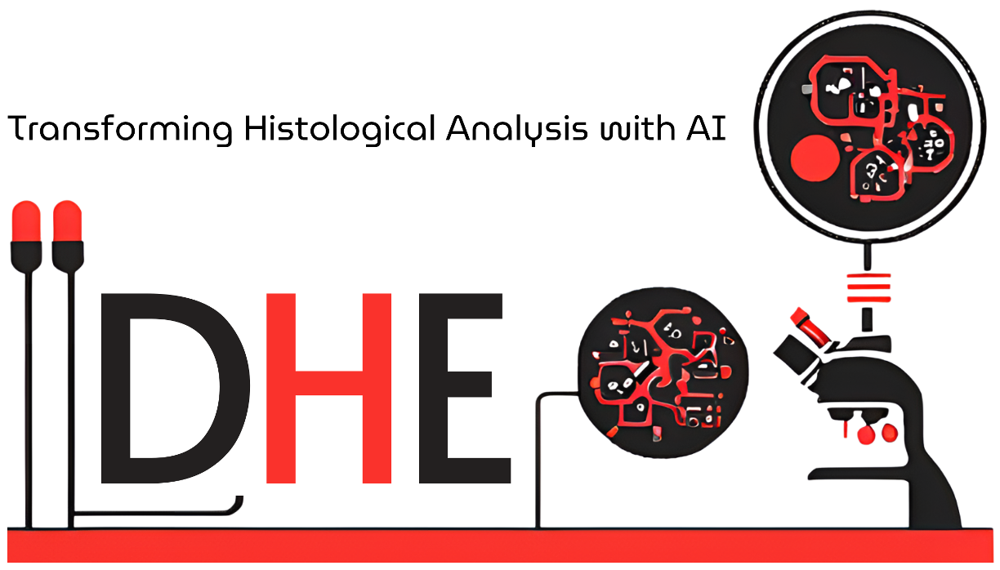

# DeepHistoExtract
Using automatic feature extraction combined with deep learning for Immunohistochemical image analysis. Deep learning performed using TensorFlow and GUI made using pyQt5 .



To implement DHE in your computer, open your terminal and type:
```
python try7.py

```
